# CbBlogsAi Site Architecture

## Site Flow Diagram

This diagram shows the complete user journey and page navigation flow for the CbBlogsAi platform.

```mermaid
flowchart TD
    Start([User Visits Site])
    Index[index.html<br/>Landing Page]
    Login[login.php<br/>Login]
    Register[registrar.php<br/>Registration]
    LP[LP.php<br/>Main Dashboard]
    
    %% Main Features
    Read[Read.php<br/>Browse Blogs]
    Write[Write.php<br/>Create Blog]
    BlogPost[blog_post.php<br/>View Single Blog]
    SaveBlog[save-blog.php<br/>Save Blog POST]
    
    %% Account Management
    Account[Account-info.php<br/>User Profile]
    UpdateAcc[updateAcc.php<br/>Edit Profile]
    EditStyle[edit_blog_style.php<br/>Customize Blog Style]
    SaveStyle[save_blog_style.php<br/>Save Style POST]
    
    %% Democratic Features
    Democracy[democracy.php<br/>Democratic Hub]
    SubmitSuggestion[submit_suggestion.php<br/>Submit Suggestion]
    SubmitGrievance[submit_grievance.php<br/>Report Problem]
    
    %% Resources
    Resources[resources.php<br/>Study Resources]
    ResourceUpload[resource_upload.php<br/>Upload Resource]
    
    %% Admin Features
    AdminDash[admin_dashboard.php<br/>Admin Panel]
    AdminActions[admin_actions.php<br/>Admin Actions POST]
    AdminSuggestions[admin_suggestions.php<br/>Manage Suggestions]
    AdminGrievances[admin_grievances.php<br/>Manage Grievances]
    
    %% Other
    Us[us.php<br/>About Us]
    Logout[logout.php<br/>Logout]
    
    %% Flow Connections
    Start --> Index
    Index --> |Not Logged In| Login
    Index --> |Not Logged In| Register
    
    Login --> |Success| LP
    Register --> |Success| LP
    
    LP --> |Navigate| Read
    LP --> |Navigate| Write
    LP --> |Navigate| Resources
    LP --> |Navigate| Democracy
    LP --> |Navigate| Account
    LP --> |Admin Only| AdminDash
    
    %% Blog Flow
    Read --> BlogPost
    Write --> SaveBlog
    SaveBlog --> |Success| Read
    
    %% Account Flow
    Account --> UpdateAcc
    Account --> EditStyle
    EditStyle --> SaveStyle
    SaveStyle --> |Success| Account
    UpdateAcc --> |Success| Account
    
    %% Democratic Flow
    Democracy --> SubmitSuggestion
    Democracy --> SubmitGrievance
    SubmitSuggestion --> |Success| Democracy
    SubmitGrievance --> |Success| Democracy
    
    %% Resources Flow
    Resources --> ResourceUpload
    ResourceUpload --> |Success| Resources
    
    %% Admin Flow
    AdminDash --> |Manage| AdminActions
    AdminDash --> |Navigate| AdminSuggestions
    AdminDash --> |Navigate| AdminGrievances
    AdminActions --> |Success| AdminDash
    
    %% Navigation from all pages
    Read -.-> |Nav| LP
    Write -.-> |Nav| LP
    Account -.-> |Nav| LP
    Resources -.-> |Nav| LP
    Democracy -.-> |Nav| LP
    AdminDash -.-> |Nav| LP
    BlogPost -.-> |Nav| Read
    
    %% Help page accessible from anywhere
    LP -.-> |Help Button| Us
    Read -.-> |Help Button| Us
    Index -.-> |Help Button| Us
    
    %% Logout from anywhere
    LP -.-> |Logout| Logout
    Read -.-> |Logout| Logout
    Write -.-> |Logout| Logout
    Account -.-> |Logout| Logout
    Resources -.-> |Logout| Logout
    Democracy -.-> |Logout| Logout
    AdminDash -.-> |Logout| Logout
    
    Logout --> Index
    
    %% Styling
    classDef publicPage fill:#e1f5ff,stroke:#01579b
    classDef authPage fill:#fff3e0,stroke:#e65100
    classDef blogPage fill:#f3e5f5,stroke:#4a148c
    classDef accountPage fill:#e8f5e9,stroke:#1b5e20
    classDef democracyPage fill:#fff9c4,stroke:#f57f17
    classDef resourcePage fill:#fce4ec,stroke:#880e4f
    classDef adminPage fill:#ffebee,stroke:#b71c1c
    classDef actionPage fill:#eceff1,stroke:#263238
    
    class Index,Us publicPage
    class Login,Register,Logout authPage
    class Read,Write,BlogPost,SaveBlog blogPage
    class Account,UpdateAcc,EditStyle,SaveStyle accountPage
    class Democracy,SubmitSuggestion,SubmitGrievance democracyPage
    class Resources,ResourceUpload resourcePage
    class AdminDash,AdminActions,AdminSuggestions,AdminGrievances adminPage
    class LP actionPage
```



## Database ER Diagram

This diagram shows all database tables and their relationships.

```mermaid
erDiagram
    user ||--o{ post : "writes"
    user ||--o| user_blog_style : "has"
    user ||--o{ comment : "creates"
    user ||--o{ study_resources : "uploads"

    user ||--o{ resource_comments : "comments_on"
    user ||--o{ suggestions : "proposes"
    user ||--o{ suggestion_supporters : "supports"

    user ||--o{ problemasHH : "reports"
    user ||--o{ grievance_communications : "communicates"
    user ||--o{ problemasHH_acciones : "admin_actions"

    user ||--o{ user_contributions : "contributes"
    user ||--o{ implemented_changes : "implements"
    
    post ||--o{ comment : "has"
    
    study_resources ||--o{ resource_comments : "has"
    
    suggestions ||--o{ suggestion_supporters : "supported_by"

    suggestions ||--o| implemented_changes : "becomes"
    
    problemasHH ||--o{ grievance_communications : "has"
    problemasHH ||--o{ problemasHH_acciones : "tracked_by"

    
    user {
        INTEGER id_usr PK "Auto-increment ID"
        TEXT usuario UK "Username (unique)"
        TEXT nombre "Full name"
        TEXT email UK "Email (unique)"
        TEXT clave "Password"
        TIMESTAMP fecha_registro "Registration date"
        INTEGER grade "Writer level 1-6"
        TEXT genero_lit_fav "Favorite genre"
    }
    
    user_blog_style {
        INTEGER id PK "Auto-increment ID"
        INTEGER user_id FK UK "User ID (unique)"
        TEXT template_name "Template: frutiger_aero/pink_classic"
        TEXT background_image "Custom background"
        TEXT font_family "Font family"
        TEXT title_size "Title font size"
        TEXT body_size "Body font size"
        TEXT text_decoration "Text decoration"
        TIMESTAMP updated_at "Last updated"
    }

    admin {
        INTEGER id_admin PK "Auto-increment ID"
        INTEGER nivel "Level 1-3"
        INTEGER usuario_id FK UK "User ID"
        TEXT asignado_reportes "Assigned reports"
        INTEGER puntos_contribucion "Contribution points"
        TIMESTAMP fecha_creacion "Creation date"
    }
    
    post {
        INTEGER id PK "Auto-increment ID"
        TEXT title "Blog title"
        TEXT subtitle "Blog subtitle"
        TEXT author_name FK "Author username"
        TEXT content "Blog content"
        TEXT tag "Category/genre tag"
        TIMESTAMP created_at "Creation date"
    }
    
    comment {
        INTEGER id PK "Auto-increment ID"
        TIMESTAMP created_at "Creation date"
        TEXT user_id_C FK "Commenter username"
        INTEGER grade "Commenter grade level"
        TEXT text "Comment content"
    }
    
    study_resources {
        INTEGER id PK "Auto-increment ID"
        TEXT title "Resource title"
        TEXT description "Description"
        TEXT subject "Subject: Math, Science, etc"
        INTEGER grade "Grade level 1-6"
        TEXT resource_type "Type: text/pdf/link"
        TEXT text_content "Text content"
        TEXT file_path "File path for PDFs"
        TEXT external_url "External link URL"
        INTEGER uploader_id FK "Uploader user ID"
        TIMESTAMP uploaded_at "Upload date"
        TIMESTAMP last_updated "Last update date"
        INTEGER view_count "View count"
        INTEGER download_count "Download count"
        INTEGER helpful_votes "Helpful votes"
        BOOLEAN is_approved "Admin approved"
        INTEGER approved_by FK "Approving admin ID"
        TIMESTAMP approved_at "Approval date"
        BOOLEAN is_flagged "Flagged content"
        TEXT flag_reason "Flag reason"
    }
    

    
    resource_comments {
        INTEGER id PK "Auto-increment ID"
        INTEGER resource_id FK "Resource ID"
        INTEGER user_id FK "Commenter user ID"
        TEXT comment_text "Comment content"
        TIMESTAMP created_at "Creation date"
        BOOLEAN is_deleted "Soft delete flag"
    }
    
    suggestions {
        INTEGER id PK "Auto-increment ID"
        TEXT title "Suggestion title"
        TEXT description "Description"
        TEXT category "Category: feature/content/community/technical/other"
        BOOLEAN is_anonymous "Anonymous submission"
        INTEGER author_id FK "Author user ID"
        TEXT status "Status: pending/under_review/in_progress/implemented/declined"
        TEXT priority "Priority: low/medium/high"
        TIMESTAMP created_at "Creation date"
        TIMESTAMP last_updated "Last update date"
        TEXT admin_response "Admin response"
        INTEGER responded_by FK "Responding admin ID"
        TIMESTAMP responded_at "Response date"
        INTEGER support_count "Community support count"
    }
    
    suggestion_supporters {
        INTEGER id PK "Auto-increment ID"
        INTEGER suggestion_id FK "Suggestion ID"
        INTEGER user_id FK "Supporter user ID"
        TIMESTAMP supported_at "Support date"
    }
    

    
    problemasHH {
        INTEGER id PK "Auto-increment ID"
        TEXT subject "Grievance subject"
        TEXT description "Description"
        TEXT category "Category: harassment/discrimination/safety/academic/facility/other"
        TEXT severity "Severity: low/medium/high/urgent"
        BOOLEAN is_anonimo "Anonymous report"
        INTEGER reporter_id FK "Reporter user ID"
        TEXT reporter_email "Follow-up email"
        BOOLEAN involves_student "Involves student"
        BOOLEAN involves_staff "Involves staff"
        BOOLEAN involves_facility "Involves facility"
        TEXT status "Status: submitted/acknowledged/investigating/resolved/closed"
        BOOLEAN is_resolved "Resolution flag"
        TEXT resumen_resolutorio "Resolution summary"
        TIMESTAMP submitted_at "Submission date"
        TIMESTAMP acknowledged_at "Acknowledgment date"
        TIMESTAMP resolved_at "Resolution date"
        INTEGER admin_asignado FK "Assigned admin ID"
        TIMESTAMP asignado_at "Assignment date"
    }
    
    grievance_communications {
        INTEGER id PK "Auto-increment ID"
        INTEGER problemasHH_id FK "Grievance ID"
        INTEGER sender_id FK "Sender user ID"
        TEXT sender_role "Role: student/admin"
        TEXT message_text "Message content"
        TIMESTAMP sent_at "Send date"
        BOOLEAN is_read "Read flag"
        TIMESTAMP read_at "Read date"
        BOOLEAN is_archived "Archive flag"
        TIMESTAMP archived_at "Archive date"
    }
    
    problemasHH_acciones {
        INTEGER id PK "Auto-increment ID"
        INTEGER problemasHH_id FK "Grievance ID"
        INTEGER admin_id FK "Admin user ID"
        TEXT tipo_accion "Action: assigned/status_change/note_added/resolved"
        TEXT detalles_accion "Action details"
        TIMESTAMP fecha_accion "Action timestamp"
    }
    

    
    user_contributions {
        INTEGER id PK "Auto-increment ID"
        INTEGER user_id FK "User ID"
        TEXT contribution_type "Type: blog/resource/suggestion/comment/helpful_vote"
        INTEGER contribution_id "ID of contribution"
        TIMESTAMP contribution_date "Contribution date"
    }
    
    implemented_changes {
        INTEGER id PK "Auto-increment ID"
        INTEGER suggestion_id FK "Original suggestion ID"
        TEXT title "Change title"
        TEXT description "Change description"
        TIMESTAMP implemented_at "Implementation date"
        INTEGER implemented_by FK "Implementing admin ID"
        INTEGER supporter_count "Original supporter count"
    }
```

## Key Features Summary

### Authentication & User Management
- **Public Access**: `index.html`, `us.php` (about page)
- **Authentication**: `login.php`, `registrar.php`, `logout.php`
- **User Profile**: `Account-info.php`, `updateAcc.php`
- **Blog Customization**: `edit_blog_style.php`, `save_blog_style.php`

### Blogging System
- **Main Dashboard**: `LP.php` - Shows user impact stats, blog count, recent implemented changes
- **Read Blogs**: `Read.php` - Browse all blogs with filtering by tag, author, date, length
- **Write Blogs**: `Write.php` - Create new blog posts with autosave
- **View Blog**: `blog_post.php` - View individual blog post with custom user styling
- **Save Blog**: `save-blog.php` - Backend handler for blog creation

### Study Resources
- **Browse Resources**: `resources.php` - View approved resources filtered by subject/grade
- **Upload Resource**: `resource_upload.php` - Share study materials (text, PDF, or links)
- Resources require admin approval before being visible to all users
- Tracking: view count, download count, helpful votes

### Democratic Features
- **Democracy Hub**: `democracy.php` - View all active suggestions
- **Submit Suggestion**: `submit_suggestion.php` - Propose improvements (can be anonymous)
- **Report Grievance**: `submit_grievance.php` - Report problems safely (can be anonymous)
- Categories: feature, content, community, technical, safety, harassment, discrimination, etc.
- Status tracking: pending → under review → in progress → implemented/declined
- Community support system for suggestions

### Admin Features (Users with ID 1-3)
- **Admin Dashboard**: `admin_dashboard.php` - Manage users and posts
- **Admin Actions**: `admin_actions.php` - Backend for user/post management
- **Manage Suggestions**: `admin_suggestions.php` - Review and respond to suggestions
- **Manage Grievances**: `admin_grievances.php` - Handle reported problems with full audit trail
- Admin-only: background uses different image (`hqliminal.jpg`)

### Database Design Highlights
- **18 Tables Total** with comprehensive relationships
- **Audit Trail**: Grievance communications and actions are never deleted (DELETE RESTRICT)
- **Soft Deletes**: Resource comments use `is_deleted` flag
- **Anonymity Support**: Suggestions and grievances can be submitted anonymously
- **Impact Tracking**: `user_contributions` and `implemented_changes` tables track democratic participation
- **Foreign Key Relationships**: Proper CASCADE and RESTRICT policies
- **Indexes**: Performance optimization on frequently queried fields

### User Grades System
- Users have a `grade` (1-6) representing writer level
- Grade is displayed throughout the site
- Resources can be filtered by grade/semester (1-6)

### Navigation Pattern
All authenticated pages share a consistent navigation bar with:
- Home (LP.php)
- Browse Blogs (Read.php)  
- Write Blog (Write.php)
- Resources (resources.php)
- Democratic Features (democracy.php)
- My Account (Account-info.php)
- Admin Dashboard (admin only)
- Logout

---

*Generated: 2025-11-25*
*Platform: CbBlogsAi - Student Forum for CBTis 03*
