# Arquitectura del Sitio CbBlogsAi

## Diagrama de Flujo del Sitio

Este diagrama muestra el viaje completo del usuario y el flujo de navegación para la plataforma CbBlogsAi.

```mermaid
flowchart TD
    Start([Usuario Visita el Sitio])
    Index[index.html<br/>Página de Aterrizaje]
    Login[login.php<br/>Iniciar Sesión]
    Register[registrar.php<br/>Registro]
    LP[LP.php<br/>Panel Principal]
    
    %% Características Principales
    Read[Read.php<br/>Leer Blogs]
    Write[Write.php<br/>Escribir Blog]
    WriteWitMedia[WriteWitMedia.php<br/>Escribir con Multimedia]
    BlogPost[blog_post.php<br/>Ver Blog Individual]
    SaveBlog[save-blog.php<br/>Guardar Blog POST]
    
    %% Gestión de Cuenta
    Account[Account-info.php<br/>Perfil de Usuario]
    UpdateAcc[updateAcc.php<br/>Editar Perfil]
    EditStyle[edit_blog_style.php<br/>Personalizar Estilo]
    SaveStyle[save_blog_style.php<br/>Guardar Estilo POST]
    
    %% Características Democráticas
    Democracy[democracy.php<br/>Centro Democrático]
    SubmitSuggestion[submit_suggestion.php<br/>Enviar Sugerencia]
    SubmitGrievance[submit_grievance.php<br/>Reportar Problema]
    
    %% Recursos
    Resources[resources.php<br/>Recursos de Estudio]
    ResourceUpload[resource_upload.php<br/>Subir Recurso]
    
    %% Características de Admin
    AdminDash[admin_dashboard.php<br/>Panel de Admin]
    AdminActions[admin_actions.php<br/>Acciones de Admin POST]
    AdminSuggestions[admin_suggestions.php<br/>Gestionar Sugerencias]
    AdminGrievances[admin_grievances.php<br/>Gestionar Reportes]
    
    %% Otros
    Us[us.php<br/>Sobre Nosotros]
    Logout[logout.php<br/>Cerrar Sesión]
    
    %% Conexiones de Flujo
    Start --> Index
    Index --> |No Logueado| Login
    Index --> |No Logueado| Register
    
    Login --> |Éxito| LP
    Register --> |Éxito| LP
    
    LP --> |Navegar| Read
    LP --> |Navegar| Write
    LP --> |> 100 Puntos| WriteWitMedia
    LP --> |Navegar| Resources
    LP --> |Navegar| Democracy
    LP --> |Navegar| Account
    LP --> |Solo Admin| AdminDash
    
    %% Flujo de Blog
    Read --> BlogPost
    Write --> SaveBlog
    WriteWitMedia --> SaveBlog
    SaveBlog --> |Éxito| Read
    
    %% Flujo de Cuenta
    Account --> UpdateAcc
    Account --> EditStyle
    EditStyle --> SaveStyle
    SaveStyle --> |Éxito| Account
    UpdateAcc --> |Éxito| Account
    
    %% Flujo Democrático
    Democracy --> SubmitSuggestion
    Democracy --> SubmitGrievance
    SubmitSuggestion --> |Éxito| Democracy
    SubmitGrievance --> |Éxito| Democracy
    
    %% Flujo de Recursos
    Resources --> ResourceUpload
    ResourceUpload --> |Éxito| Resources
    
    %% Flujo de Admin
    AdminDash --> |Gestionar| AdminActions
    AdminDash --> |Navegar| AdminSuggestions
    AdminDash --> |Navegar| AdminGrievances
    AdminActions --> |Éxito| AdminDash
    
    %% Navegación desde todas las páginas
    Read -.-> |Nav| LP
    Write -.-> |Nav| LP
    WriteWitMedia -.-> |Nav| LP
    Account -.-> |Nav| LP
    Resources -.-> |Nav| LP
    Democracy -.-> |Nav| LP
    AdminDash -.-> |Nav| LP
    BlogPost -.-> |Nav| Read
    
    %% Página de ayuda accesible desde cualquier lugar
    LP -.-> |Botón Ayuda| Us
    Read -.-> |Botón Ayuda| Us
    Index -.-> |Botón Ayuda| Us
    
    %% Cerrar sesión desde cualquier lugar
    LP -.-> |Salir| Logout
    Read -.-> |Salir| Logout
    Write -.-> |Salir| Logout
    WriteWitMedia -.-> |Salir| Logout
    Account -.-> |Salir| Logout
    Resources -.-> |Salir| Logout
    Democracy -.-> |Salir| Logout
    AdminDash -.-> |Salir| Logout
    
    Logout --> Index
    
    %% Estilos
    classDef publicPage fill:#e1f5ff,stroke:#01579b
    classDef authPage fill:#fff3e0,stroke:#e65100
    classDef blogPage fill:#f3e5f5,stroke:#4a148c
    classDef accountPage fill:#e8f5e9,stroke:#1b5e20
    classDef democracyPage fill:#fff9c4,stroke:#f57f17
    classDef resourcePage fill:#fce4ec,stroke:#880e4f
    classDef adminPage fill:#ffebee,stroke:#b71c1c
    classDef actionPage fill:#eceff1,stroke:#263238
    
    class Index,Us publicPage
    class Login,Register,Logout authPage
    class Read,Write,WriteWitMedia,BlogPost,SaveBlog blogPage
    class Account,UpdateAcc,EditStyle,SaveStyle accountPage
    class Democracy,SubmitSuggestion,SubmitGrievance democracyPage
    class Resources,ResourceUpload resourcePage
    class AdminDash,AdminActions,AdminSuggestions,AdminGrievances adminPage
    class LP actionPage
```



## Diagrama ER de Base de Datos

Este diagrama muestra todas las tablas de la base de datos y sus relaciones.

```mermaid
erDiagram
    user ||--o{ post : "escribe"
    user ||--o| user_blog_style : "tiene"
    user ||--o{ comment : "crea"
    user ||--o{ study_resources : "sube"

    user ||--o{ resource_comments : "comenta_en"
    user ||--o{ suggestions : "propone"
    user ||--o{ suggestion_supporters : "apoya"
    user ||--o{ suggestion_comments : "comenta_en"

    user ||--o{ problemasHH : "reporta"
    user ||--o{ grievance_communications : "comunica"
    user ||--o{ problemasHH_acciones : "acciones_admin"

    user ||--o{ user_contributions : "contribuye"
    user ||--o{ implemented_changes : "implementa"
    
    post ||--o{ comment : "tiene"
    
    study_resources ||--o{ resource_comments : "tiene"
    
    suggestions ||--o{ suggestion_supporters : "apoyado_por"
    suggestions ||--o{ suggestion_comments : "tiene"

    suggestions ||--o| implemented_changes : "se_convierte_en"
    
    problemasHH ||--o{ grievance_communications : "tiene"
    problemasHH ||--o{ problemasHH_acciones : "rastreado_por"

    
    user {
        INTEGER id_usr PK "ID Auto-incrementable"
        TEXT usuario UK "Nombre de usuario (único)"
        TEXT nombre "Nombre completo"
        TEXT email UK "Email (único)"
        TEXT clave "Contraseña"
        TIMESTAMP fecha_registro "Fecha de registro"
        INTEGER grade "Nivel de escritor 1-6"
        INTEGER user_contributions "Puntos de contribución"
        TEXT genero_lit_fav "Género favorito"
    }
    
    user_blog_style {
        INTEGER id PK "ID Auto-incrementable"
        INTEGER user_id FK UK "ID Usuario (único)"
        TEXT template_name "Plantilla: frutiger_aero/pink_classic"
        TEXT background_image "Fondo personalizado"
        TEXT font_family "Familia de fuente"
        TEXT title_size "Tamaño fuente título"
        TEXT body_size "Tamaño fuente cuerpo"
        TEXT text_decoration "Decoración de texto"
        TIMESTAMP updated_at "Última actualización"
    }

    admin {
        INTEGER id_admin PK "ID Auto-incrementable"
        INTEGER nivel "Nivel 1-3"
        INTEGER usuario_id FK UK "ID Usuario"
        TEXT asignado_reportes "Reportes asignados"
        INTEGER puntos_contribucion "Puntos de contribución"
        TIMESTAMP fecha_creacion "Fecha de creación"
    }
    
    post {
        INTEGER id PK "ID Auto-incrementable"
        TEXT title "Título del blog"
        TEXT subtitle "Subtítulo del blog"
        TEXT author_name FK "Usuario del autor"
        TEXT content "Contenido del blog"
        TEXT tag "Etiqueta de categoría/género"
        TIMESTAMP created_at "Fecha de creación"
        TEXT file_path "Ruta de archivo multimedia"
    }
    
    comment {
        INTEGER id PK "ID Auto-incrementable"
        TIMESTAMP created_at "Fecha de creación"
        TEXT user_id_C FK "Usuario del comentarista"
        INTEGER grade "Nivel del comentarista"
        TEXT text "Contenido del comentario"
    }
    
    study_resources {
        INTEGER id PK "ID Auto-incrementable"
        TEXT title "Título del recurso"
        TEXT description "Descripción"
        TEXT subject "Materia: Mate, Ciencias, etc"
        INTEGER grade "Grado 1-6"
        TEXT resource_type "Tipo: texto/pdf/enlace"
        TEXT text_content "Contenido de texto"
        TEXT file_path "Ruta de archivo PDF"
        TEXT external_url "URL de enlace externo"
        INTEGER uploader_id FK "ID Usuario que subió"
        TIMESTAMP uploaded_at "Fecha de subida"
        TIMESTAMP last_updated "Fecha última actualización"
        INTEGER view_count "Conteo de vistas"
        INTEGER download_count "Conteo de descargas"
        INTEGER helpful_votes "Votos de utilidad"
        BOOLEAN is_approved "Aprobado por admin"
        INTEGER approved_by FK "ID Admin que aprobó"
        TIMESTAMP approved_at "Fecha de aprobación"
        BOOLEAN is_flagged "Contenido reportado"
        TEXT flag_reason "Razón del reporte"
    }
    
    resource_comments {
        INTEGER id PK "ID Auto-incrementable"
        INTEGER resource_id FK "ID Recurso"
        INTEGER user_id FK "ID Usuario comentarista"
        TEXT comment_text "Contenido del comentario"
        TIMESTAMP created_at "Fecha de creación"
        BOOLEAN is_deleted "Bandera de borrado suave"
    }
    
    suggestions {
        INTEGER id PK "ID Auto-incrementable"
        TEXT title "Título de sugerencia"
        TEXT description "Descripción"
        TEXT category "Categoría: característica/contenido/comunidad/técnico/otro"
        BOOLEAN is_anonymous "Envío anónimo"
        INTEGER author_id FK "ID Usuario autor"
        TEXT status "Estado: pendiente/en_revisión/en_progreso/implementado/rechazado"
        TEXT priority "Prioridad: baja/media/alta"
        TIMESTAMP created_at "Fecha de creación"
        TIMESTAMP last_updated "Fecha última actualización"
        TEXT admin_response "Respuesta de admin"
        INTEGER responded_by FK "ID Admin que respondió"
        TIMESTAMP responded_at "Fecha de respuesta"
        INTEGER support_count "Conteo de apoyo comunitario"
    }
    
    suggestion_supporters {
        INTEGER id PK "ID Auto-incrementable"
        INTEGER suggestion_id FK "ID Sugerencia"
        INTEGER user_id FK "ID Usuario simpatizante"
        TIMESTAMP supported_at "Fecha de apoyo"
    }
    
    suggestion_comments {
        INTEGER id PK "ID Auto-incrementable"
        INTEGER suggestion_id FK "ID Sugerencia"
        INTEGER user_id FK "ID Usuario"
        TEXT comment_text "Texto del comentario"
        TIMESTAMP created_at "Fecha de creación"
        BOOLEAN is_deleted "Borrado suave"
    }
    
    problemasHH {
        INTEGER id PK "ID Auto-incrementable"
        TEXT subject "Asunto del reporte"
        TEXT description "Descripción"
        TEXT category "Categoría: acoso/discriminación/seguridad/académico/instalaciones/otro"
        TEXT severity "Severidad: baja/media/alta/urgente"
        BOOLEAN is_anonimo "Reporte anónimo"
        INTEGER reporter_id FK "ID Usuario reportante"
        TEXT reporter_email "Email de seguimiento"
        BOOLEAN involves_student "Involucra estudiante"
        BOOLEAN involves_staff "Involucra personal"
        BOOLEAN involves_facility "Involucra instalaciones"
        TEXT status "Estado: enviado/reconocido/investigando/resuelto/cerrado"
        BOOLEAN is_resolved "Bandera de resolución"
        TEXT resumen_resolutorio "Resumen de resolución"
        TIMESTAMP submitted_at "Fecha de envío"
        TIMESTAMP acknowledged_at "Fecha de reconocimiento"
        TIMESTAMP resolved_at "Fecha de resolución"
        INTEGER admin_asignado FK "ID Admin asignado"
        TIMESTAMP asignado_at "Fecha de asignación"
    }
    
    grievance_communications {
        INTEGER id PK "ID Auto-incrementable"
        INTEGER problemasHH_id FK "ID Reporte"
        INTEGER sender_id FK "ID Usuario remitente"
        TEXT sender_role "Rol: estudiante/admin"
        TEXT message_text "Contenido del mensaje"
        TIMESTAMP sent_at "Fecha de envío"
        BOOLEAN is_read "Bandera de leído"
        TIMESTAMP read_at "Fecha de lectura"
        BOOLEAN is_archived "Bandera de archivado"
        TIMESTAMP archived_at "Fecha de archivado"
    }
    
    problemasHH_acciones {
        INTEGER id PK "ID Auto-incrementable"
        INTEGER problemasHH_id FK "ID Reporte"
        INTEGER admin_id FK "ID Usuario Admin"
        TEXT tipo_accion "Acción: asignado/cambio_estado/nota_agregada/resuelto"
        TEXT detalles_accion "Detalles de la acción"
        TIMESTAMP fecha_accion "Marca de tiempo de acción"
    }
    
    user_contributions {
        INTEGER id PK "ID Auto-incrementable"
        INTEGER user_id FK "ID Usuario"
        TEXT contribution_type "Tipo: blog/recurso/sugerencia/comentario/voto_útil"
        INTEGER contribution_id "ID de la contribución"
        TIMESTAMP contribution_date "Fecha de contribución"
    }
    
    implemented_changes {
        INTEGER id PK "ID Auto-incrementable"
        INTEGER suggestion_id FK "ID Sugerencia original"
        TEXT title "Título del cambio"
        TEXT description "Descripción del cambio"
        TIMESTAMP implemented_at "Fecha de implementación"
        INTEGER implemented_by FK "ID Admin implementador"
        INTEGER supporter_count "Conteo original de simpatizantes"
    }
```

## Resumen de Características Clave

### Autenticación y Gestión de Usuarios
- **Acceso Público**: `index.html`, `us.php` (página sobre nosotros)
- **Autenticación**: `login.php`, `registrar.php`, `logout.php`
- **Perfil de Usuario**: `Account-info.php`, `updateAcc.php`
- **Personalización de Blog**: `edit_blog_style.php`, `save_blog_style.php`

### Sistema de Blogs
- **Panel Principal**: `LP.php` - Muestra estadísticas de impacto del usuario, conteo de blogs, cambios implementados recientes
- **Leer Blogs**: `Read.php` - Navegar todos los blogs con filtrado por etiqueta, autor, fecha, longitud
- **Escribir Blogs**: `Write.php` - Crear nuevas publicaciones de blog con autoguardado
- **Escribir con Multimedia**: `WriteWitMedia.php` - Crear blogs avanzados con imágenes de fondo (Requiere >100 puntos)
- **Ver Blog**: `blog_post.php` - Ver publicación individual con estilo personalizado del usuario
- **Guardar Blog**: `save-blog.php` - Manejador backend para creación de blogs

### Recursos de Estudio
- **Navegar Recursos**: `resources.php` - Ver recursos aprobados filtrados por materia/grado
- **Subir Recurso**: `resource_upload.php` - Compartir materiales de estudio (texto, PDF o enlaces)
- Los recursos requieren aprobación de admin antes de ser visibles para todos los usuarios
- Seguimiento: conteo de vistas, conteo de descargas, votos de utilidad

### Características Democráticas
- **Centro Democrático**: `democracy.php` - Ver todas las sugerencias activas
- **Enviar Sugerencia**: `submit_suggestion.php` - Proponer mejoras (puede ser anónimo)
- **Reportar Problema**: `submit_grievance.php` - Reportar problemas de forma segura (puede ser anónimo)
- Categorías: característica, contenido, comunidad, técnico, seguridad, acoso, discriminación, etc.
- Seguimiento de estado: pendiente → en revisión → en progreso → implementado/rechazado
- Sistema de apoyo comunitario para sugerencias

### Características de Admin (Usuarios con ID 1-3)
- **Panel de Admin**: `admin_dashboard.php` - Gestionar usuarios y publicaciones
- **Acciones de Admin**: `admin_actions.php` - Backend para gestión de usuarios/publicaciones
- **Gestionar Sugerencias**: `admin_suggestions.php` - Revisar y responder a sugerencias
- **Gestionar Reportes**: `admin_grievances.php` - Manejar problemas reportados con rastro de auditoría completo
- Solo Admin: el fondo usa una imagen diferente (`hqliminal.jpg`)

### Destacados del Diseño de Base de Datos
- **19 Tablas en Total** con relaciones completas
- **Rastro de Auditoría**: Las comunicaciones y acciones de reportes nunca se borran (DELETE RESTRICT)
- **Borrados Suaves**: Los comentarios de recursos y sugerencias usan la bandera `is_deleted`
- **Soporte de Anonimato**: Las sugerencias y reportes pueden enviarse anónimamente
- **Seguimiento de Impacto**: Las tablas `user_contributions` e `implemented_changes` rastrean la participación democrática
- **Relaciones de Clave Foránea**: Políticas adecuadas de CASCADE y RESTRICT
- **Índices**: Optimización de rendimiento en campos consultados frecuentemente

### Sistema de Niveles de Usuario
- Los usuarios tienen un `grade` (1-6) que representa el nivel de escritor
- El nivel se muestra en todo el sitio
- Los recursos pueden filtrarse por grado/semestre (1-6)

### Patrón de Navegación
Todas las páginas autenticadas comparten una barra de navegación consistente con:
- Inicio (LP.php)
- Leer Blogs (Read.php)  
- Escribir Blog (Write.php)
- Recursos (resources.php)
- Características Democráticas (democracy.php)
- Mi Cuenta (Account-info.php)
- Panel de Admin (solo admin)
- Cerrar Sesión

---

*Generado: 2025-12-04*
*Plataforma: CbBlogsAi - Foro Estudiantil para CBTis 03*
